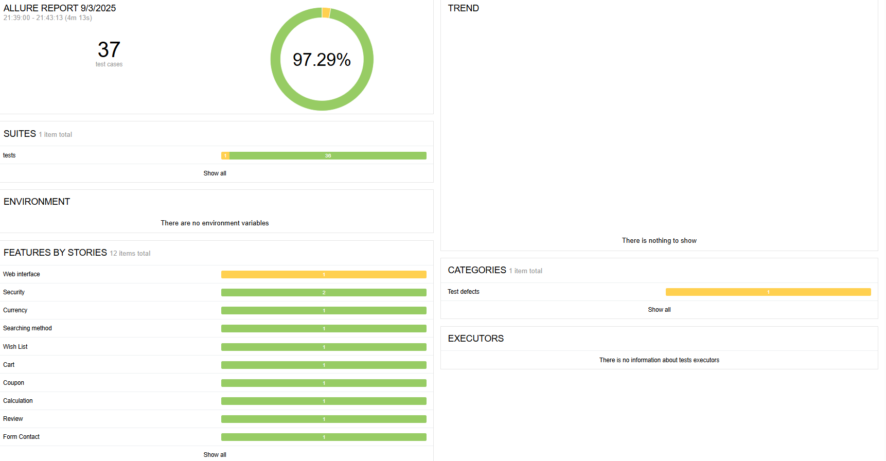
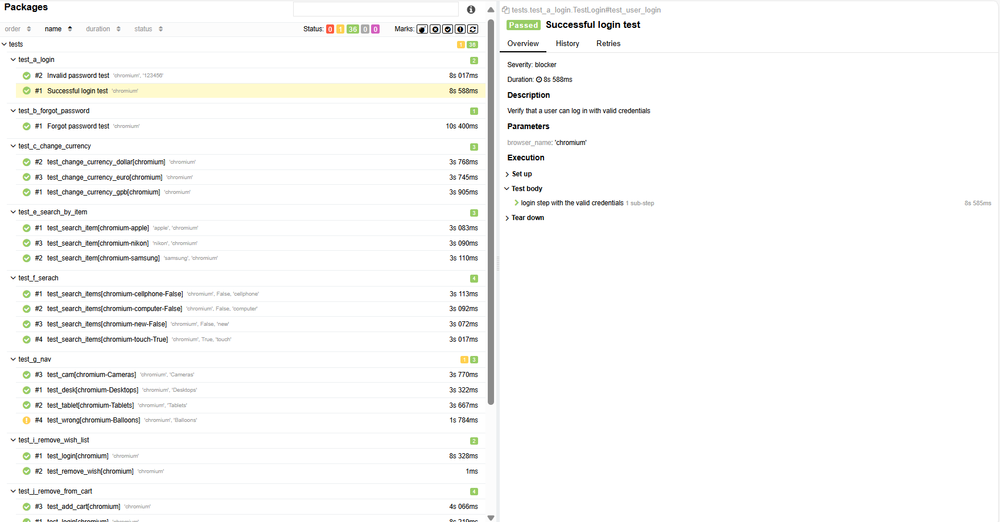

# 🛒 My Final Project Automation - Shani Pitaru


## 📖 Overview
The goal of this project is to create **automation tests** for the main use cases of an e-commerce website.  
It covers both **positive and negative scenarios**, validates proper behavior and structure of the site, and ensures accurate results in different flows.

---

## 🛠️ Tech Stack
- **Language**: Python  
- **Framework**: Pytest  
- **Reports**: Allure (report generator)  
- **CI/CD**: GitHub Actions with Allure integration  
- **Version Control**: GitHub  

---

## ⚙️ Installation
1. Clone the repository  
   ```bash
   git clone https://github.com/shanip89/FinalAutomation_project.git
   ```
2. Install **PyCharm** or any preferred IDE.  
3. Install required dependencies from `requirements.txt`:  
   ```bash
   pip install -r requirements.txt
   ```
4. Install **pytest** and **allure-pytest** plugin inside your environment:
   ```bash
   pip install pytest allure-pytest
   ```

---

## ▶️ Running Tests
Run tests with pytest and generate allure reports:  
```bash
pytest --alluredir=allure-results
```

To view the report in browser:
```bash
allure serve allure-results
```

*(In CI/CD with GitHub Actions, Allure reports are generated and published automatically.)*

---


## ✅ What is Tested

- Login with valid credentials  
- Login with invalid credentials  
- Forgot password flow  
- Change currency option  
- Add and remove products from cart  
- Navigate through main menu  
- Add and remove products from wishlist  
- Product search functionality  
- Invalid coupon check  
- Shipping cost calculation  
- Submit product review  
- Fill contact form  
- Update address  
- Logout from account  

## 📂 Project Structure
```
Final/
├── data/               # Test data
├── pages/              # All page classes using POM
├── tests/              # All test cases
├── utils/              # Utility functions
├── allure/             # Allure reports
├── config.ini          # Configs (like login credentials)
├── pytest.ini          # Pytest configs
├── requirements.txt    # Dependencies
└── README.md
```

---

## ✨ Features
 ✅ Page Object Model (POM) implementation  
 ✅ Positive & Negative test coverage  
 ✅ Allure detailed test reports with steps & screenshots  
 ✅ GitHub Actions integration for CI/CD  
 ✅ Easy to extend and maintain  

---

## 📊 CI/CD with GitHub Actions
This project uses **GitHub Actions** to automatically:
- Run all tests on each push/pull request  
- Generate and publish **Allure reports**  

---

## 🎥 Demo
Here’s an example of the automation in action:  

*(Recommended: Add a short **GIF** here. You can create one from your video with tools like [ScreenToGif](https://www.screentogif.com/) or [EZGif](https://ezgif.com/).)*

```markdown

```
## 📊 Reports and Dashboards

- 🔗 [Allure Live Report](#)  

  
 
---

## 📬 Contact

- 👩‍💻 Shani Pitaru  
- 🌐 [LinkedIn](https://www.linkedin.com/in/shani-pitaru/)  

---

## 👩‍💻 Author
Created by **Shani Pitaru**

